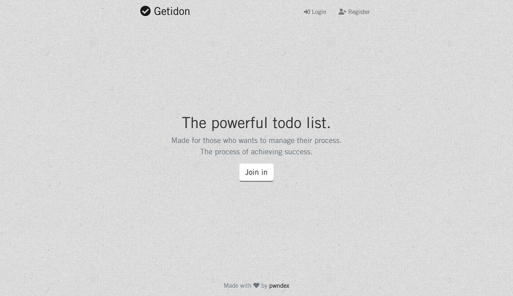
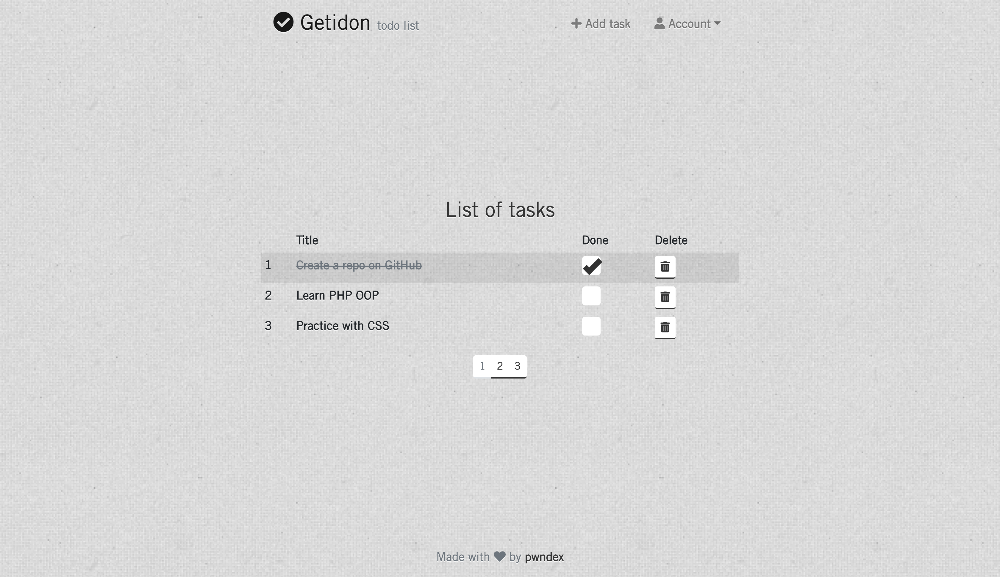

# About Getidon

Getidon is the powerful todo list, built in Laravel framework

## Requirements

You need to have the following installed:

* PHP
* composer
* Nginx
* MySQL
* [Laravel](https://laravel.com/docs/7.x)

## Getting Started

Clone the repository to your local machine
```shell
git clone https://github.com/pwndex/Getidon.git
```

Open Getidon folder and copy .env file
```shell
cd Getidon
cp .env.example .env
```

Install all dependencies via composer and npm
```shell
composer install
npm install
```

Compile styles and scripts via npm and generate key via artisan
```shell
npm run dev
php artisan key:generate
```

Set up your MySQL database credentials inside .env file
```shell
DB_DATABASE=<YOUR_DATABASE_NAME>
DB_USERNAME=<YOUR_DATABASE_USERNAME>
DB_PASSWORD=<YOUR_DATABASE_PASSWORD>
```

Make migrate and run the app
```shell
php artisan migrate
php artisan serve
```



## License

The Getidon is open-sourced software licensed under the [MIT license](https://opensource.org/licenses/MIT).